# bitcask

A C++20 implementation of the [Bitcask](https://riak.com/assets/bitcask-intro.pdf) log-structured key-value storage engine.

All writes are appended sequentially to data files, with an in-memory index mapping every key to its on-disk position. The read path checks the index first, then seeks directly into the data file.

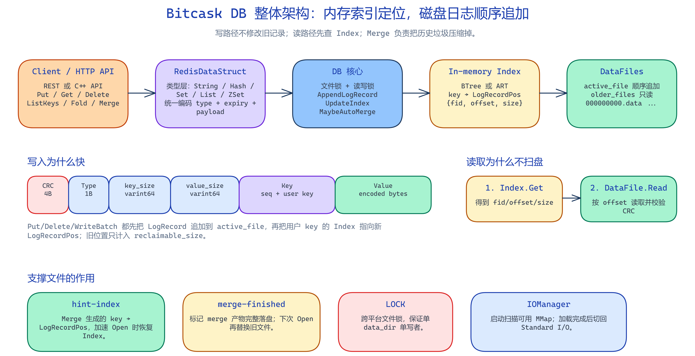

## Features

- **Log-structured storage** — append-only writes, no in-place updates
- **Two index backends** — B-tree (`absl::btree_map`) and Adaptive Radix Tree (`libart`)
- **WriteBatch** — atomic batch writes with transaction sequence numbers
- **Merge compaction** — reclaim disk space from stale/deleted records, with optional auto-merge
- **Iterator** — forward and reverse iteration with prefix filtering
- **File locking** — single-writer enforcement (cross-platform)
- **MMap I/O** — memory-mapped files for fast index rebuilding on startup
- **HTTP REST API** — optional HTTP wrapper for remote access
- **Redis protocol server** — RESP command handling for strings, hashes, sets, lists, and sorted sets
- **Cross-platform** — Windows and POSIX support

## Building

**Prerequisites:** CMake 3.24+, Ninja, a C++20 compiler, and [vcpkg](https://vcpkg.io/). Dependencies are declared in `vcpkg.json`.

```sh
export VCPKG_ROOT=/home/smooth/vcpkg
cmake -S . -B build -G Ninja \
  -DCMAKE_BUILD_TYPE=Release \
  -DCMAKE_TOOLCHAIN_FILE="$VCPKG_ROOT/scripts/buildsystems/vcpkg.cmake"
cmake --build build
```

For VS Code CMake Tools, this repository includes `.vscode/settings.json` with the Ninja generator and the local `VCPKG_ROOT` used by this workspace. If your vcpkg checkout lives elsewhere, update that path or set the environment before reconfiguring. After changing CMake settings, run **CMake: Delete Cache and Reconfigure**.

**Build targets:**

| Target | Description |
|--------|-------------|
| `bitcask_http` | HTTP server executable |
| `bitcask_redis` | Redis protocol server executable |
| `bitcask_tests` | Test runner (Catch2) |
| `bitcask_bench` | Benchmark runner (Google Benchmark) |

## Quick Start

```cpp
#include "db.h"

int main() {
    auto db = bitcask::DB::Open(bitcask::Options{.data_dir = "./testdb"});
    db->Put("hello", "world");
    auto val = db->Get("hello"); // "world"
    db->Delete("hello");
    db->Close();
}
```

## API

### Database

```cpp
// Open a database (creates the directory if needed)
auto db = bitcask::DB::Open(bitcask::Options{.data_dir = "./mydb"});

// CRUD
absl::Status Put(std::string_view key, std::string_view value);
std::optional<std::string> Get(std::string_view key);
absl::Status Delete(std::string_view key);

// Iteration
auto iter = db->NewIterator(bitcask::IteratorOptions{.prefix = "user:", .reverse = false});
for (iter->Rewind(); iter->Valid(); iter->Next()) {
    auto key = iter->Key();
    auto value = iter->Value();
}

// List all keys
auto keys = db->ListKeys();

// Visit all key-value pairs (return false to stop early)
db->Fold([](std::string_view key, std::string value) -> bool {
    // process...
    return true;
});

// Stats
auto stat = db->Stat(); // {key_num, data_file_num, reclaimable_size, disk_size}

// Merge compaction (reclaims space from stale records)
db->Merge();

// Backup
db->Backup("/path/to/backup");

// Sync and close
db->Sync();
db->Close();
```

### WriteBatch

```cpp
bitcask::WriteBatch batch(db.get(), bitcask::WriteBatchOptions{.sync_on_commit = true});
batch.Put("key1", "value1");
batch.Put("key2", "value2");
batch.Delete("key3");
batch.Commit(); // atomically writes all operations
```

### Options

```cpp
struct Options {
    std::string data_dir;                    // database directory path
    uint64_t max_data_file_size = 10 * 1024 * 1024;  // 10 MB per data file
    bool sync_on_write = false;              // fsync after every write
    IndexType index_type = IndexType::BTree; // BTree or ART
    uint64_t bytes_per_sync = 0;             // periodic fsync threshold (0 = disabled)
    double auto_merge_reclaim_ratio = 0.0;   // auto-merge when reclaimable/disk > ratio (0 = disabled)
};
```

## HTTP API

Build and run the HTTP server:

```sh
bitcask_http --data-dir ./bitcask_data --host 127.0.0.1 --port 8080
```

**Endpoints:**

| Method | Path | Description |
|--------|------|-------------|
| `GET` | `/v1/health` | Health check |
| `PUT` | `/v1/kv/<key>` | Store value (raw body) |
| `GET` | `/v1/kv/<key>` | Retrieve value |
| `DELETE` | `/v1/kv/<key>` | Delete key |
| `GET` | `/v1/keys` | List all keys |
| `GET` | `/v1/entries?prefix=<p>&reverse=true` | List key-value pairs |
| `GET` | `/v1/stats` | Database statistics |
| `POST` | `/v1/sync` | Force fsync |
| `POST` | `/v1/merge` | Trigger merge compaction |
| `POST` | `/v1/backup?dest=<path>` | Backup data directory |

All responses are JSON with CORS headers.

## Redis API

Build and run the Redis-compatible server:

```sh
bitcask_redis --data-dir ./bitcask_data --host 127.0.0.1 --port 6379
```

Supported command families:

| Type | Commands |
|------|----------|
| Connection | `PING`, `ECHO`, `QUIT` |
| String | `SET`, `GET`, `DEL`, `TYPE` |
| Hash | `HSET`, `HGET`, `HDEL` |
| List | `LPUSH`, `RPUSH`, `LPOP`, `RPOP`, `LLEN` |
| Set | `SADD`, `SISMEMBER`, `SREM` |
| Sorted set | `ZADD`, `ZSCORE`, `ZREM` |

## Benchmarks

Release build on 8-core 2304 MHz CPU (Windows, MSVC):

```
Benchmark                        Time        items/s
BM_DBPutOverwrite/128           1.1 µs      988.7k/s
BM_DBPutUniqueKeys/128          1.5 µs      796.4k/s
BM_DBGet/10000                 18.5 µs       54.3k/s
BM_DBDeleteExistingKey          1.3 µs      833.5k/s
BM_WriteBatchCommit/100         1.4 ms      250.6k/s
```

## Data Format

Data files are append-only. Each record stores a CRC, record type, varint-encoded key/value sizes, then the encoded key and value bytes.

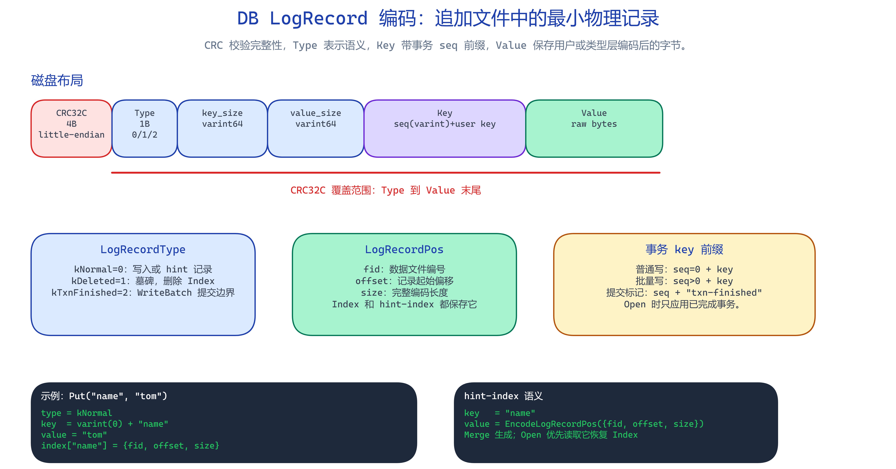

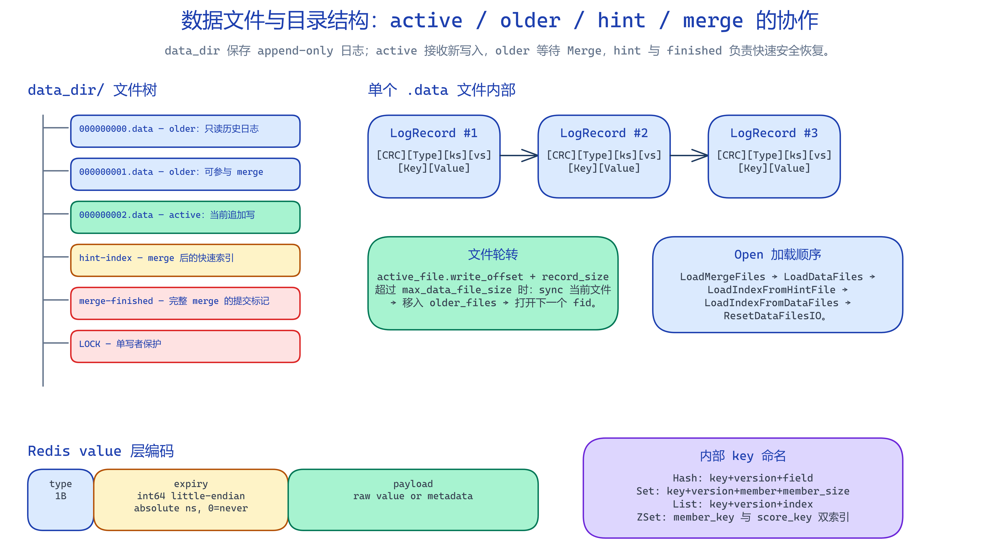

Record types: `Normal(0)`, `Deleted(1)`, `TxnFinished(2)`.

## Architecture

- **Writes** append to the active data file and update the in-memory index.
- **Reads** look up the key in the index, then seek to the offset in the data file.
- **Merge** compacts older data files by copying only live records, producing hint files for fast reopens.

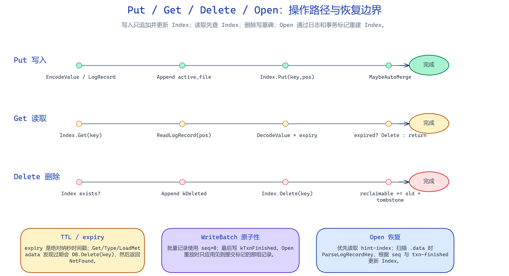

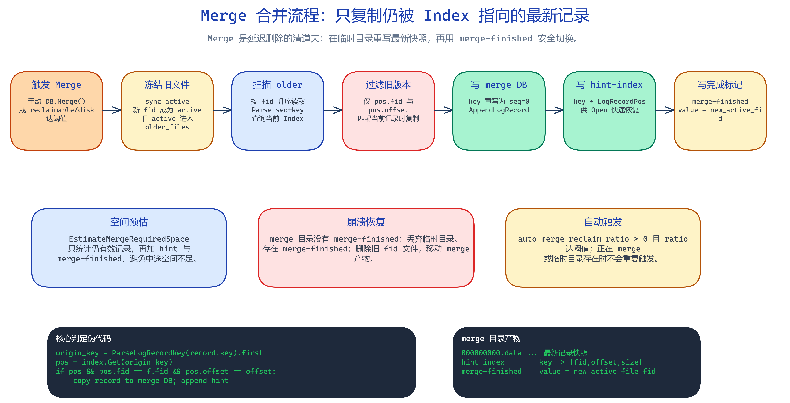

## Diagrams

The diagrams in `docs/` are exported PNGs with matching Excalidraw sources. Edit the `.excalidraw` file first, then export the PNG with the same base name.

| Area | PNG | Source |
|------|-----|--------|
| Architecture |  | [architecture.excalidraw](docs/architecture.excalidraw) |
| Operation flows |  | [operation-flows.excalidraw](docs/operation-flows.excalidraw) |
| Merge flow |  | [merge-flow.excalidraw](docs/merge-flow.excalidraw) |
| Data file layout |  | [data-file-structure.excalidraw](docs/data-file-structure.excalidraw) |
| Log record layout |  | [db-log-record.excalidraw](docs/db-log-record.excalidraw) |
| Redis model | 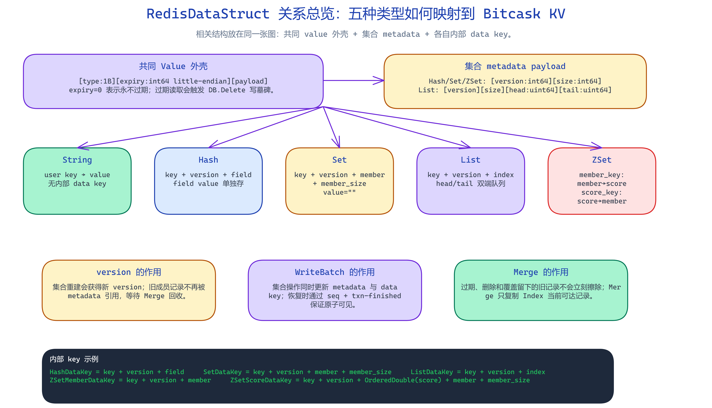 | [redis-structures.excalidraw](docs/redis-structures.excalidraw) |
| String encoding | 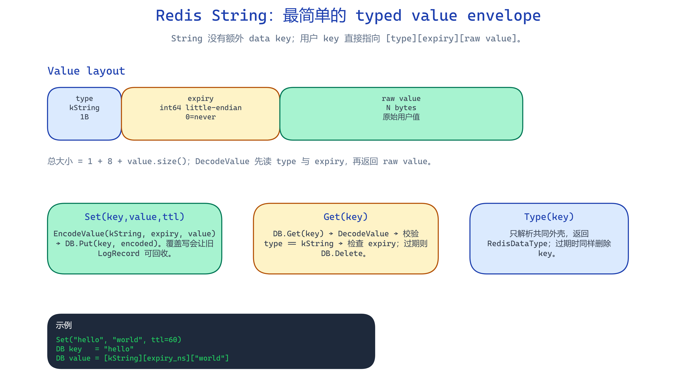 | [string-structure.excalidraw](docs/string-structure.excalidraw) |
| Hash encoding | 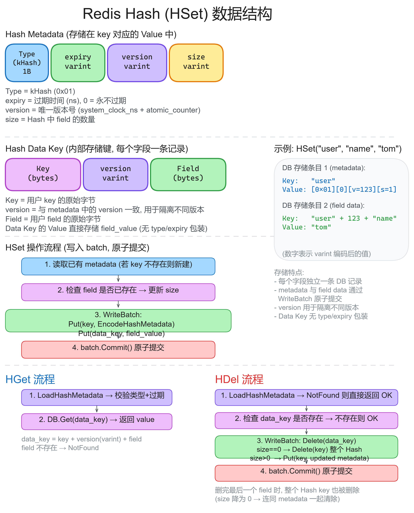 | [hset-structure.excalidraw](docs/hset-structure.excalidraw) |
| Set encoding | 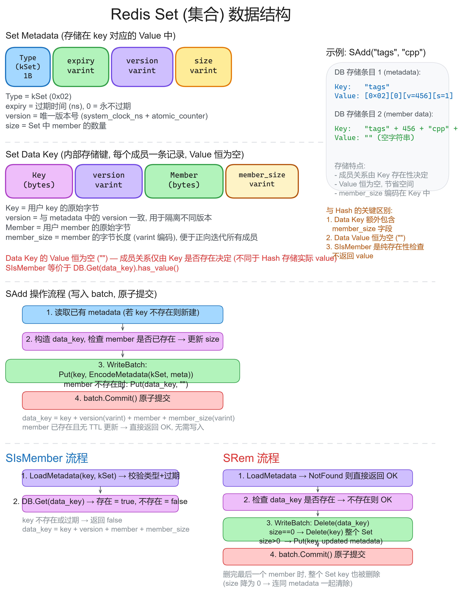 | [set-structure.excalidraw](docs/set-structure.excalidraw) |
| List encoding | 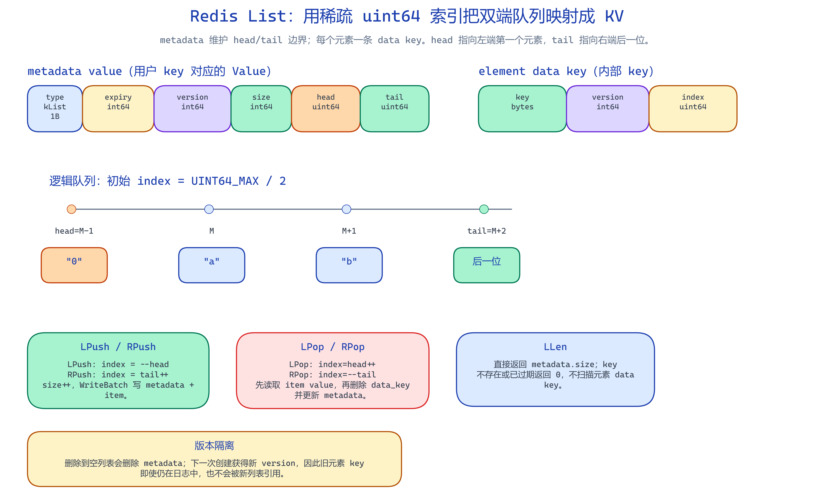 | [list-structure.excalidraw](docs/list-structure.excalidraw) |
| Sorted set encoding | 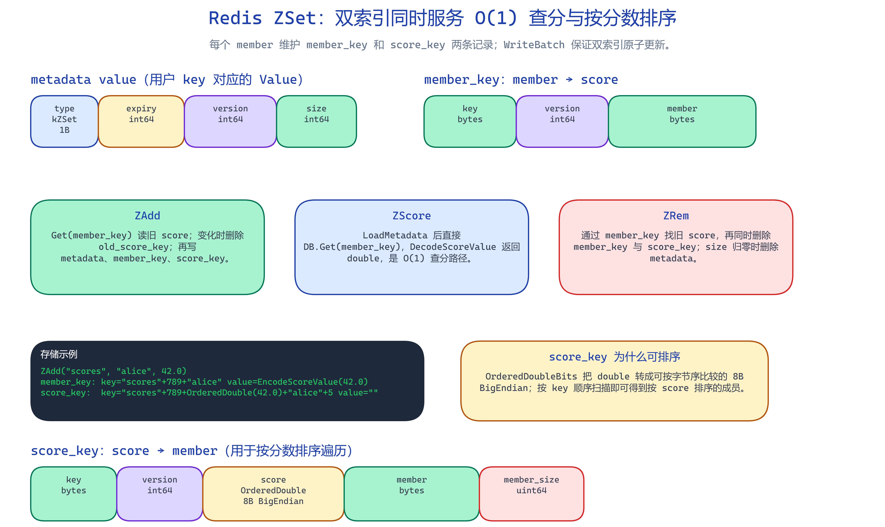 | [zset-structure.excalidraw](docs/zset-structure.excalidraw) |

## Dependencies

| Library | Purpose |
|---------|---------|
| [Abseil](https://abseil.io/) | B-tree, Status/StatusOr, CRC32C, strings, mutex |
| [protobuf](https://protobuf.dev/) | Varint encoding |
| [libart](https://github.com/armon/libart) | Adaptive Radix Tree index |
| [cpp-httplib](https://github.com/yhirose/cpp-httplib) | HTTP server |
| [Asio](https://think-async.com/Asio/) | Redis TCP server |
| [hiredis](https://github.com/redis/hiredis) | RESP parsing |
| [tlx](https://github.com/tlx/tlx) | Algorithm/container utilities |

Dev dependencies: [Catch2](https://github.com/catchorg/Catch2) (testing), [Google Benchmark](https://github.com/google/benchmark) (benchmarking).

## Testing

```sh
cmake --build build --target bitcask_tests
ctest --test-dir build
```

## License

This project is distributed under the terms of the MIT license.

Copyright 2025 Yifan Liu
